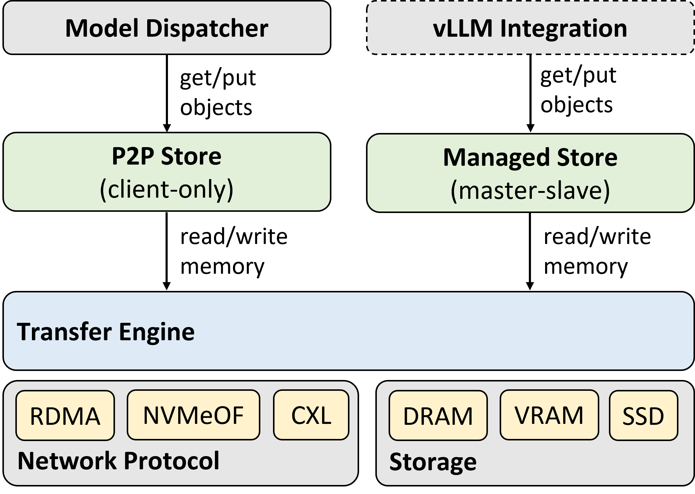

# Mooncake

Mooncake 是面向长上下文大语言模型（LLM）的推理加速系统，与推理系统的其他模块保持松耦合。它采用以 KVCache 为中心的分离架构，不仅分离了预填充（prefill）和解码（decoding）集群，还实现集群中 CPU、GPU、DRAM、SSD 和 NIC 资源的充分利用。在长上下文场景中，Mooncake 能有效提高请求容量并符合 SLO 要求。目前 Mooncake 已在 Moonshot Kimi 中实际运行，每天可处理高达 100B 个 tokens，在 NVIDIA A800 和 H800 集群上处理请求效率分别比以前的系统高出 115% 和 107%。

要了解有关 Mooncake 的更多信息，请参阅我们的论文 [arXiv 2407.00079](https://arxiv.org/abs/2407.00079)。

## 架构
Mooncake 由以下部分组成：

1. **[Mooncake Transfer Engine](docs/transfer_engine.md)**：高性能，零拷贝数据传输库。提供统一、高效、可靠的数据传输接口，支持 RDMA（含 GPUDirect RDMA）、NVMeOF 等传输协议，DRAM、GPU VRAM、NVMe SSD 等传输介质。支持带宽聚合、自动优选传输路径等功能。该部分用以支撑 Mooncake Store 的数据传输，也可独立用于各类应用高效的数据传输。

2. **Mooncake Store**：对象级别的数据存取引擎。面向 KVCache 等中小规模数据缓存需求，通过 **Managed Store** 接口实现副本数量及所在位置的灵活管理；面向模型分发等大规模数据缓存需求，通过 **P2P Store** 接口实现数据的共享读取。
   > ℹ️ 正在逐步开源，敬请期待！

## 快速开始
目前我们开源了 Transfer Engine 的完整实现，并提供了以下 3 个示例应用：
1. 基本 I/O 读写操作测试工具 Transfer Engine Bench
2. 点对点数据共享读取接口 P2P Store 及配套的样例程序
3. vLLM Disaggregated Prefill & Decode 样例

具体的编译和使用说明参见 [快速开始指南](docs/quick-start.md)。

## 更进一步
请参考 [Mooncake 开发文档](docs/) 以获取更多信息。

## 性能
将 Transfer Engine 的 I/O 延迟与 Gloo （由 Distributed PyTorch 使用）和 TCP 进行比较，Transfer Engine 具有最低的延迟。
在传输 40 GB 数据（相当于 LLaMA3-70B 模型下 128k token 所产生的 KVCache 大小）的情况下，Transfer Engine 在 4×200 Gbps 和 8×400 Gbps RoCE 的网络配置下分别提供高达 87 GB/s 和 190 GB/s 的带宽，**比 TCP 协议快约 2.4 倍和 4.6 倍**。

## 开源许可
Mooncake 项目遵循 TBD 开源协议，详见 [LICENSE]()。

## 贡献
我们欢迎社区的贡献！如果你有任何建议或发现问题，请通过 GitHub Issues 提交，或直接提交 Pull Request。
