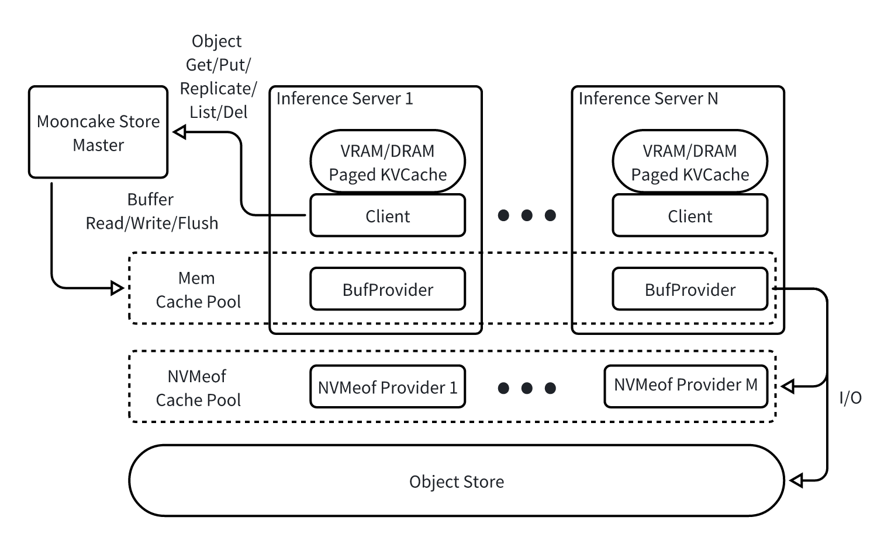

# 设计目标和约束

本质上来说解耦开来的 Mooncake Store 就是在一个慢速的对象存储之上基于高速互联的 DRAM/SSD 资源构建的一个池化的多级缓存。和传统缓存比最大特点是能够基于 (GPUDirect) RDMA 技术尽可能零拷贝的从发起端的 DRAM/VRAM 拷贝至接受端的 DRAM/SSD，且尽可能最大化利用单机多网卡的资源。

核心设计目标和约束如下

- 以 Object Get/Put 而非 File Read/Write 为核心抽象管理数据，且最小分配单元为 16KB（带测），即不针对小对象优化。
- 支持在缓存层多副本保存数据，但不保证绝对的高可用，极端情况下仅写入了缓存层还未异步刷入下层慢速对象存储上的数据会丢失
- 保证 Object Put 的原子性，即 Get 一定会读到某次 Put 生成的完整的数据。但不保证 Linearizability，即 Get 可能不会读到最新一次 Put 的结果。 提供一个类似 ZooKeeper 的 Sync 操作来强制达成 freshness 的要求。
- 对较大的 Object 进行条带化和并行处理。Object Size 较大时单个 Object 的 Get/Put 就需要可以利用多网卡的聚合带宽。
- 缓存对象支持 Eager/Lazy/None 三种下刷慢速对象存储的模式，分别对应持久化要求从高到低的对象。
- 支持动态增删缓存资源。
- 【待确定】Mooncake Store 本身虽然是缓存层但自身语义是 store 而非 cache，不实现缓存替换和冷热识别等策略。策略由上层实现，Mooncake Store 本身只提供在各个缓存层之间迁移和删除以及必要的统计信息上报接口。

# 总体架构

基于上述目标设计上下两层的实现结构。上层控制面向 Client 提供 Object 级别的 Get/Put 等操作，下层数据面则是提供 VRAM/DRAM/NVM Buffer 层面的尽可能零拷贝和多网卡池化的数据传输。具体如下图如所示



从 Object 到 VRAM/DRAM/NVM Buffer 的映射关系和对应的空间管理由 Master 负责，BufProvider 仅负责提供空间和执行具体的数据传输任务。具体来说

- 有两大类 Buffer

  - 一类每一个 Client 都会在同一个进程内

    - 开辟用户指定大小的一段 Memory Segment 作为可以供 Master 进行空间分配的全局池化 DRAM Cache Pool 的组成部分
    - 它也可以注册一些本地 DRAM 区域进 RDMA 以供其它节点直接 RDMA 读写但是这些区域的分配管理不由 Master 负责 -- 比如 vLLM 的 DRAM PageCache 区域
    - Client 和 BufProvider 必须是同一个进程里，而不是 shared memory（due to VRAM，优势是简化指针管理）

  - 另一类是被注册到 NVMeof 中的一段 SSD 空间

- 在 BufProvider 这边看来他们都是 segment_id -> <base_addr, size> 这样标识的一个大块数组，实际在这个大块数组中进行空间分配和管理的操作是在远端的 Master 中进行的。
- 即 BufProvider 并不知道本地空间哪些被分配了哪些没有，只是被动地接受 Master 直接通过 offset 指定的对应区间之间的数据传输请求。

Client 除了可以 Get/Put 外还可以通过 Replicate 命令改变一个 Object 以 {dram_replicate_num: int, nvmeof_replicate_num: int, flush:{Eager/Lazy/None}} 三元组所代表的复制状态。具体来说对于一个标号为 ID 大小为 size 的 Object 的一次版本为 ver 的 Put 实际上会被存储为

- dram_replicate_num \* ceil(size/dram_shard_size) 个 DRAM Block，标号分别为 ID-ver-DRAM_Replica_i-Shard_j。其中 dram_shard_size 为全局 config，取决于最小多小能跑满 RDMA （4KB 应该就够）
- nvmeof_replicate_num \* ceil(size/nvmeof_shard_size) 个 SSD Block，标号分别为 ID-ver-NVMeof_Replica_i-Shard_j。其中 nvmeof_shard_size 为全局 config，取决于最小多小能跑满 NVMeof （待测）
- 一个（或零个，如果 flush=None）下层对象存储上的对象，key 为 ID

可以看到在上层缓存层每一次的 Put 实际上都会获得一个新的 version 所以实际上下层存储空间是不共享的，也就是不支持 in-place update。这样比较方便保证原子性，旧版本异步自动空间回收就行。但是最下层只有一个版本，由 Master 保证按照 version 顺序下刷（flush=Lazy 的情况可能跳过一些中间版本）。

Replicate 操作如果增加或者删除了副本数量的话 Master 自己通过空间管理和调用数据面的操作来达成对应分布。类似的机制也可以用在故障恢复中。

上下两层提供的具体 API 如下所示：

# Client - Object-level API

所有 Object-level API 均为异步 API，其对应任务提交到本地任务队列后就会返回 TaskID 用于查询相关任务状态，此时甚至连 Master 都还没联系。

```C++
typedef int64_t ObjectVersion, TaskID;
struct TaskStatus {
    enum Status {WAITING, PENDING, INVALID, CANCELED, COMPLETE, TIMEOUT, FAILED};
    Status s;
}
// 查询对应任务状态，不同任务有不同的状态内容
TaskStatus *QueryTask(TaskID id);
```

Put 操作每次会获得一个新的 version，同时上层可以通过监控 PutTaskStatus 来判断当前写入是否已经达到了所需的可靠性

```C++
typedef vector<str> ObjectKey;
enum PtrType {DRAM, VRAM, NVMEof};
struct ReplicateConfig {
    int dram_replicate_num, nvmeof_replicate_num;
    enum FlushType {EAGER, LAZY, NONE};
    FlushType flush;
};


// 将 key 对于 Object 的值设置为
//    [ptrs[0]:ptrs[0]+size[0]]:...:[ptrs[-1]:ptrs[-1]+size[-1]]
// 的内容并按照 config 设置进行复制。
// offsets 可以全部指向 VRAM（此时下层会尽可能使用 GPUDirect RDMA/Storage 实现传输）
// 也可以全部指向 DRAM，但暂时不支持混杂也不支持 NVMeof 作为源端
TaskID AsyncPut(ObjectKey key, PtrType type, vector<void *> ptrs, vector<void *> sizes, ReplicateConfig config);

struct PutTaskStatus(TaskStatus) {
    ObjectVersion version; // 本次 Put 被分配到的 version
    int dram_replicated_num; // 完整复制完成的 DRAM 副本数
    int nvmeof_replicated_num; // 完整复制完成的 NVMeof 副本数
    int flushed; // 是否下刷到下层存储

    // TODO: Full
    int err_code;

    // 每个特定的 XXTaskStatus 都应该包含其对应任务的输入参数，以下略
    ObjectKey key, PtrType type, vector<void *> ptrs, vector<void *> sizes, ReplicateConfig config;
};
```

Get 操作可以指定一个 min_version 来要求至少读大于等于这个 version 的数据。如果系统当前没有完成对应 version 的写入则直接返回 Get 操作失败同时返回当前可以读的最大的 version

```C++
// 将 key 对于 Object 从 offset 开始的数据按顺序读入
//    [ptrs[0]:ptrs[0]+size[0]]:...:[ptrs[-1]:ptrs[-1]+size[-1]]
// 如果 sizes 综合小于 sizeof(Object)-offset 则截断，如果长于则剩余空间放置不动。
// offsets 可以全部指向 VRAM（此时下层会尽可能使用 GPUDirect RDMA/Storage 实现传输）
// 也可以全部指向 DRAM，但暂时不支持混杂
// min_version 不为 -1 时有最小版本要求
TaskID AsyncGet(ObjectKey key, PtrType type, vector<void *> ptrs, vector<void *> sizes, ObjectVersion min_version=-1, size_t offset=0);

struct GetTaskStatus(TaskStatus) {
    // Status.s 为 COMPLETE 时记录本次读到的 version
    // Status.s 为 FAILED 时记录可以读到的最大 version（实际未去读取）
    // 其余时候为 -1
    ObjectVersion largest_read_version = -1;
};
```

Replicate 修改副本状态

```C++
// 修改对应 Object 副本状态为 new_config，可以增也可以删
TaskID AsyncReplicate(ObjectKey key, ReplicateConfig new_config);

struct PutTaskStatus(TaskStatus) {
    ObjectVersion version; // 本次 Replicate 实际去操作的 version
    int cur_dram_replicated_num; // 完整复制完成的 DRAM 副本数
    int cur_dram_replicated_num; // 完整复制完成的 NVMeof 副本数
    int cur_flushed; // 是否下刷到下层存储
};
```

其它主要 API

```C++
// 删除 key 对应的 Object
TaskID AsyncDel(ObjectKey key);

// TODO
... List...
```

内部模块详细设计见 TODO

# Master - 元数据和控制流管理

Master 主要负责

- Buffer 的空间分配管理
- 维护从 Object Key 到具体的 Buffer 的映射关系
- 驱动具体的节点执行数据传输操作

## Buffer 的空间分配管理

一共有两类 Buffer Segment，一种是一个 Client 内部开辟的唯一对应的一个可供 Master 分配空间的 DRAM Segment（可以是 GPU 服务器上的也可以是独立的缓存服务器），一种是一个 NVMeof Target（可以是某一台机器上某个 SSD Device 的一个分区被某张网卡绑定后形成的，也可以是外部存储提供的）。前者会被注册成 RDMA Memory Region 供其他机器 RDMA Read/Write，后者则在需要的时候会被其他机器挂载并通过 GPUDirect Storage 访问。

### Segment

为了维护当前所有存在的 segment 在 Master 上会维护如下的元数据

```C++
struct SegmentDescriptor {
    enum SegmentType { Memory, NVMEof } type;
    uint64_t base_addr;
    uint64_t size;
};
struct MemSegmentDescriptor(SegmentDescriptor) {
    string owner_uri;
    // 同一台机器上可能有多个 RDMA 设备可以访问这一地址，需要提供 ib_dev_name 列表如 'mlx5_X'
    vector<string> ib_dev_name;
    vector<uint32_t> rkey;
};
struct NVMeofSegmentDescriptor(SegmentDescriptor) {
    ... info used for mount ...
};
map<int, SegmentDescriptor> segments;
SegmentDescriptor GetSegment(int segment_id);
```

为了新增这一元数据 Master 会对外提供一个 RPC API

```C++
int RegisterSegment(SegmentDescriptor descriptor); // 返回 segment_id
```

在注册阶段，新加入的 Client 需要首先向 Master 节点发送 RegisterSegment RPC，Master 节点会赋予一个**唯一的 segment id** 并返回给该 Client。

- 当使用 DRAM SHM Segment 时，需要传递该 Segment 的基地址 base_addr 和长度 size，以及可用的 RDMA 设备列表 ib_dev_name（形如 'mlx5_X'）
- 当使用 NVMeof Segment 时，需要传递用于远程 Client 挂载的参数（如 IP、密码等）

```C++
// In CLIENT
int SetupSegment(int segment_id, SegmentDescriptor descriptor);

// 对于每张网卡，都对应一个结构体
struct RDMAQPRegDesc {
    uint32_t lid;
    vector<uint32_t> qp_num;
    string gid;
};

int SetupRDMAConnections(const vector<RDMAQPRegDesc> &request_qp_reg_desc,
                         vector<RDMAQPRegDesc> &response_qp_reg_desc);
```

Master 节点在注册阶段，除了在本地记录 SegmentDescriptor 并赋予唯一序号外，还需要逐个向集群内的所有**其他** Client 发送 SetupSegment RPC，目的是让集群中的每个 Client 都具备访问该 Segment 的能力。该过程同时隐含要求 RegisterSegment RPC 严格串行执行。

- 当使用 DRAM SHM Segment 时，原 Client 节点（未持有该 Segment 的节点）需与新 Client 节点（持有该 Segment 的节点）建立 QP 连接。

  **建立** **QP** **连接（双向）**

  - 原 Client 节点按照 descriptor 参数的信息知道新 Client 节点有 N_new 张卡，需要与自己的 N_old 张卡建立 QP 连接，所需数量至少是 max(N_old, N_new) \* QP_MUL_FACTOR。QP_MUL_FACTOR 表示一对卡建立的 QP 数量。原 Client 节点和新 Client 节点的映射方案是按顺序一一对应（如果数量不等则少的那一边 round robin）
  - 原 Client 节点按规则完成 QP 对象创建阶段，提取 LID、GID、QPNum 信息
  - 通过 SetupRDMAConnections RPC 发送到新 Client 节点。新 Client 节点接收到请求后，按 a. 规则完成 QP 对象创建与建连阶段，返回 LID、GID、QPNum 信息
  - 原 Client 节点继续完成 QP 对象建连阶段

  上述过程中，已有的对象无需重复创建的可以直接重用（如与网卡设备相关联的 ibv_context 等）。操作结束时，每一个 Client 节点都可明确“为与集群内任何一个 Client 节点通信，需要使用的 QP 对象列表”。

  **Memory Region 元数据传递**【20240718 更新】这一阶段不再需要，理由是在创建 Segment 时就可以取得每张卡的 rkey，因此 SetupSegment RPC 下发时的 descriptor 就可以包含此参数。

- 当使用 NVMeof Segment 时，原 Client 节点按照 descriptor 参数的信息，将 NVMeof 设备挂载到本地（该过程可能需要 root）。 segment id 与挂载点目录的关系存储于 Client 本地

### Allocator

空间分配机制是一个标准的 slab allocator，只是实际上的空间不在 master 本地而是在对应的 Buffer Segment 上，Master 这里只是维护一个 offset。

```C++
typedef pair<ObjectKey, vector<str> > BufferKey;
struct BufHandle {
    int segment_id;
    uint64_t offset, size;
    enum BufStatus {INIT, PARTIAL, COMPLETE} status;
};
class Allocator {
public:
    BufHandle allocate(int segment_id, BufferKey key, uint64_t size);
    BufHandle find(BufferKey key);
    bool remove(BufferKey key);
};
```

## 映射关系

本质上就是一个 Object Key 对应多个 version；一个 version 对应多个 replica；一个 replica 对应多个 BufHandle 的多级 hashmap。

```C++
atomic_uint64_t global_version; // Version 维护一个全局的就行，不需要每个 Object 单独维护
typedef vector<vector<BufHandle>> ReplicaList;
struct VersionList {
    concurrent_hashmap<Version, ReplicaList> versions;
    uint64_t flushed_version;
    ReplicateConfig config;
};
typedef concurrent_hashmap<ObjectKey, VersionList> object_meta;
```

object_meta 本身其实不持久化也行，如果 master 挂了可以完全丢弃掉全部缓存从慢速对象存储开始。如果要留下来的话可以异步保存 consistent snapshot 就行，主要是需要维护 flushed_version 以防下层的写被覆盖。

一个具体的 buffer 选哪个 segment 只要 random 一下就行，也不用特意 hash。

## 驱动数据传输

Master 在收到用户的 Get/Put/Replicate 操作后会首先根据自身保存的元数据进行必要的空间分配并获取对应的指针。分配完成后 Master 将用户的操作进行必要的空间分配分解为从一台或多台 Initiator 指向的 (GPUDirect) RDMA/Storage 操作。Buffer-level API 最终的核心目的就是在 Master 测提供一个异步接口用于驱动单个 initiator 指向具体的数据传输。

```C++
struct TransferRequest {
    // Initiator 上的 source 指针
    // 注意是 initiator 上的不是 master 上的，可以是 VRAM/DRAM 两种
    // TODO: 需要知道是哪个 shm segment 吗？
    uint64_t source_offset;

    // 目标节点 ID，可能是某台机器上的 DRAM segment 也可能是一个 NVMeof Device
    int target_id;
    size_t target_offset; // 对应 Buffer 上的起始 offset

    enum OpCode { READ, WRITE } opcode; // initiator 去读还是去写 target
    size_t length; // 读写长度
};

TaskID AsyncBatchTransfer(int source_id, PtrType type, const std::vector<TransferRequest> &entries);
struct TransferTaskStatus(TaskStatus) {
    uint64_t ret; // 传输了多少数据
}
struct BatchTransferTaskStatus(TaskStatus) {
    vector<TransferTaskStatus> status; // 对应每个 TransferRequest 的当前状态
};
```

# BufProvider - 数据传输执行

## 数据通路

实际执行从发起端 Initiator 的本地 DRAM 或者 VRAM 通过 (GPUDirect) RDMA 读写本地/远端的某个 SHM 或者 NVMeof 的 Buffer Segment 中的某一段。实际一共有三种路径

- Local memcpy: 如果 target 其实就在本地的话直接走 cudaMemcpy

  - TODO: 验证一下 cudaMemcpy 两边都是 DRAM 的话是不是等价于 memcpy
  - 大块拷贝的时候切分成小块多后端线程去处理

- RDMA Verbs: Local DRAM/VRAM -[(GPUDirect) RDMA Read/Write]-> Local/Remote DRAM

  - 暂不支持远端 VRAM，如果需要的话把远端作为 Initiator 操作反向就行
  - DRAM 都需要注册成 RDMA 的 memory region
  - VRAM 目前考虑不强制注册，而是每张 GPU 上开一小块 VRAM Buffer，仅仅注册这一块 Buffer。实际传输的时候内部拷贝一次再 GPUDirect RDMA 传输
  - 支持多网卡池化，同样是大块切小块然后每一个小块按照当前对网卡繁忙程度的估计选一个丢出去

- cuFile (GPUDirect Storage): Local DRAM/VRAM -[(GPUDirect) Storage Read/Write]-> Local/Remote NVMeof

  - TODO: 需要验证一下 cuFile 如果一段不是 VRAM 是 DRAM 的时候下面实际走的是什么路径
  - 目前主要是兼容性设计，第二阶段才会实际合入

## 对外 RPC 接口

BufProvider 的对外 RPC 接口列示如下：

1.  初始化 Segment 阶段，Master 阶段向其他 Client 节点发送 SetupSegment RPC，让这些节点具备访问该 Segment 的能力。对于 RDMA 此过程还涉及 QP 建联过程，需要 SetupRDMAConnections RPC 辅助。

```C++
// In CLIENT
int SetupSegment(int segment_id, SegmentDescriptor descriptor, string owner_hostname);

// 对于每张网卡，都对应一个结构体
struct RDMARegDesc {
    uint32_t lid;
    vector<uint32_t> qp_num;
    string gid;
}

int SetupRDMAConnections(const vector<RDMARegDesc> &request_reg_desc,
                         vector<RDMARegDesc> &response_reg_desc,
                         vector<uint16_t> &response_rkeys);
```

2.  数据传输阶段，该接口同 Master 的 AsyncBatchTransfer RPC 等，实际上 Master 的相应 RPC 过程会将此请求转发到**发起方 Client**。由于在初始化 Segment 阶段发起方 Client 知道 target_id 对应的内部状态参数（如 RDMA 的 qp、addr、rkey，以及 NVMeof 的文件），因此 RPC 接收方可根据指示直接调内部的 transfer 接口。自己传自己也是一样。

```C++
enum Opcode { READ, WRITE };

struct TransferRequest {
    // Initiator 上的 source 指针
    // 注意是 initiator 上的不是 master 上的，可以是 VRAM/DRAM 两种
    // TODO: 需要知道是哪个 shm segment 吗？
    uint64_t source_offset;

    // 目标节点 ID，可能是某台机器上的 DRAM segment 也可能是一个 NVMeof Device
    int target_id;
    size_t target_offset; // 对应 Buffer 上的起始 offset

    enum OpCode { READ, WRITE } opcode; // initiator 去读还是去写 target
    size_t length; // 读写长度
};

TaskID DoBatchTransfer(int source_id, PtrType type, const std::vector<TransferRequest> &entries);

int BatchTransferStatus(TaskID id, std::vector<BatchTransferTaskStatus> &status);
```
